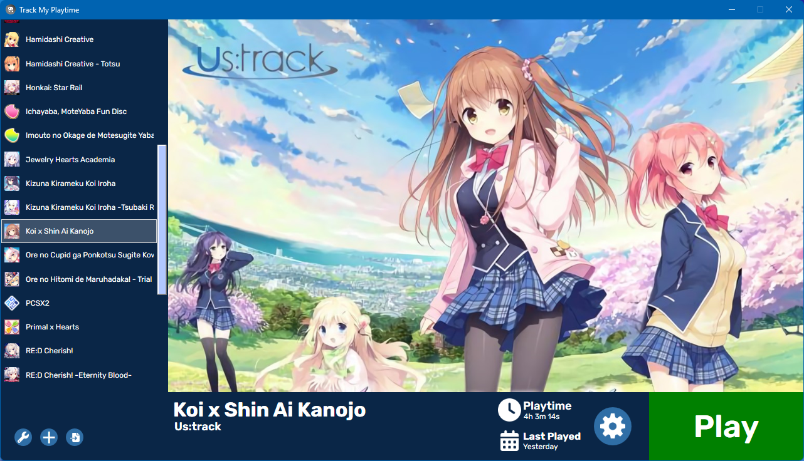
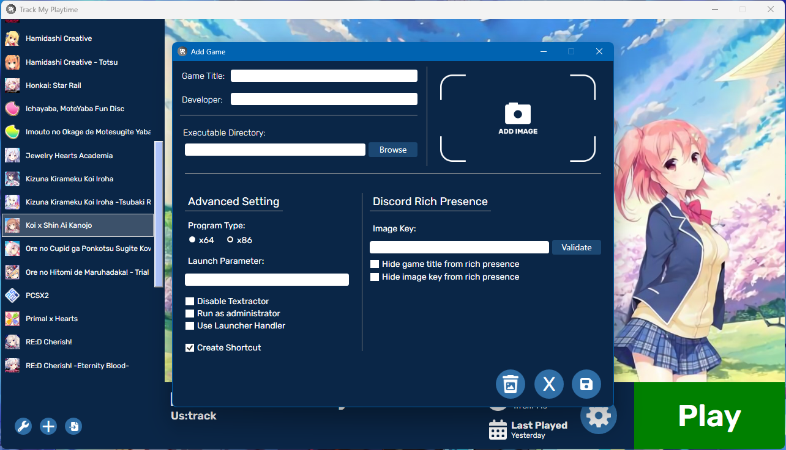

# Track My Playtime

A simple program that is ready to help you to always know your game playtime

## ⭐ Featured
- Gameplay Time Tracker
- Discord Rich Presence
- Makes it easier for you when you want to choose a vn game from your collection
- Screenshot _(not all games can be supported)_

### 📖 Intended for Visual Novel games
If you like playing visual novel games, then you should try using this program, because you can find out how much time it takes to complete the vn game you are going to play.

> If you play vn games in Japanese or other languages, I have also added the auto [Textractor](https://github.com/Artikash/Textractor) launch feature when you run your game, so the [Textractor](https://github.com/Artikash/Textractor) will automatically run at the same time when you start the game you are going to play.  
> Of course you have to have the program first

##  Discord Rich Presence
Let your friends or others know what you're playing with the Discord Rich Presence feature.  
You can also provide a custom image using a url that you can enter into the game list that you created.

## :framed_picture: Screenshot
<table>
  <tr>
    <td></td>
    <td></td>
  </tr>
</table>

## :file_folder: Download
You can download this program for **free!**  
Goto [Official Web](https://kidixdev.github.io/trackmyplaytimeweb/) or enter the [Release](https://github.com/KidiXDev/TrackMyPlaytime/releases) section and then just download the latest available release.

## :page_facing_up: How to install
After you have finished downloading the installer, just install it as usual, when finished the program will be installed on your computer.  

> **Note**
> Sometimes antivirus considers this program as a _virus_ which has been confirmed to be a **false positive**, you can find the source code above and you can see for yourself if this program is completely **safe**.

## :question: Help
If you need help or have problems, please contact me:
- Discord Server: [Link](https://discord.gg/xWPBs55DUc)

Or you can report bugs to the [Issue](https://github.com/KidiXDev/TrackMyPlaytime/issues) section.
